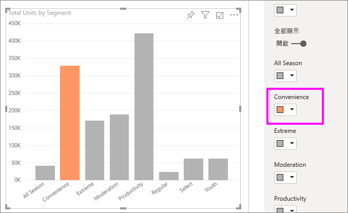
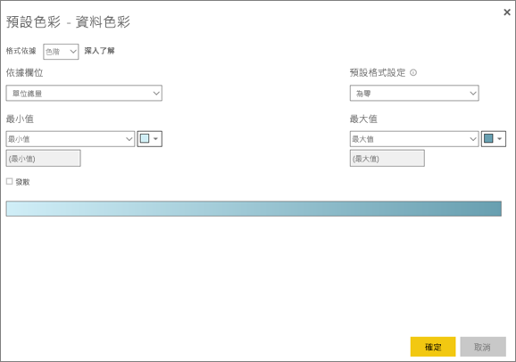
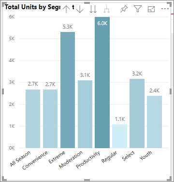
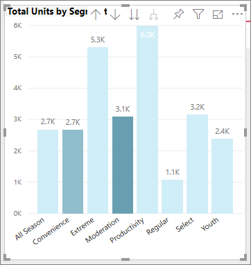
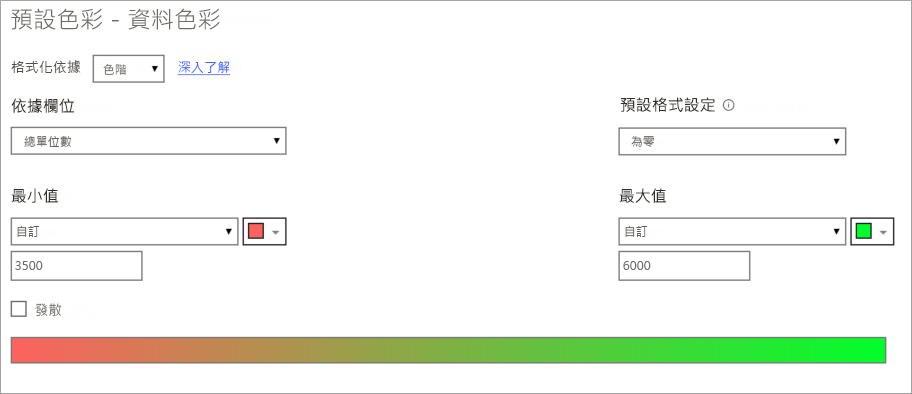
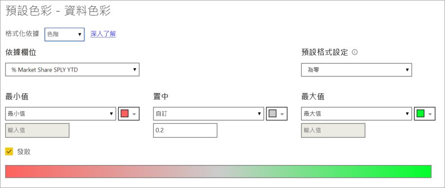
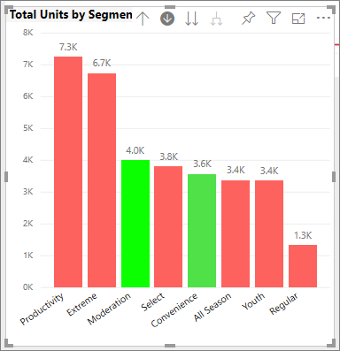
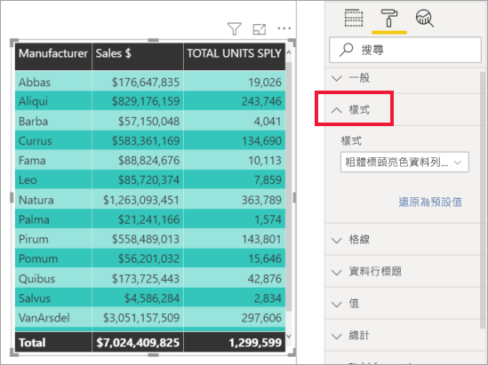

# 在 Power BI 中色彩格式化的秘訣和訣竅

[!INCLUDE[consumer-appliesto-nyyn](../includes/consumer-appliesto-nyyn.md)]    

Power BI 提供許多不同的方式，用來自訂您的儀表板和報表。 本文詳細說明一系列秘訣，讓您的 Power BI 視覺效果更吸引人、更加有趣，且視您的需求自訂。

這裡提供下列秘訣。 有其他絕佳的秘訣嗎？ 太棒了！ 請寄給我們，我們會考慮將您的秘訣加入這個清單。

* 將主題套用至整個報表
* 變更單一資料點的色彩
* 條件式格式設定
* 根據數值設定圖表的色彩
* 根據欄位值設定資料點的色彩
* 自訂色階中所使用的色彩
* 使用發散色階
* 將色彩新增至資料表資料列
* 如何在 Power BI 中復原

若要做出任何變更，您必須要有報表的編輯權限。 在 Power BI Desktop 中，於 [報表] 檢視中開啟報表。 在 Power BI 服務中，這代表您需要開啟報表並在功能表列中選取 [編輯]，如下圖所示。

![哪裡可以找到 [編輯] 功能表](media/service-tips-and-tricks-for-color-formatting/power-bi-edit-report.png)

當 [篩選] 和 [視覺效果] 窗格顯示於報表畫布右側時，即可開始進行自訂。 如果窗格沒有顯示，請選取右上角的箭號予以開啟。

![在 [編輯檢視] 中的報表畫布](media/service-tips-and-tricks-for-color-formatting/power-bi-edit.png)

## 套用佈景主題
透過報表主題，您可以將設計變更套用至整個報表，例如使用公司色彩、變更圖示集，或套用新的預設視覺效果格式。 當您套用報表主題時，報表中的所有視覺效果都會使用所選主題中的色彩和格式。 若要深入了解，請參閱[使用報表主題](../create-reports/desktop-report-themes.md)

在這裡，我們已將 [創新] 主題套用至銷售與行銷報表。

![已套用 [創新] 主題](media/service-tips-and-tricks-for-color-formatting/power-bi-theme-innovate.png)

## 變更單一資料點的色彩
有時候您會想要醒目顯示一個特定的資料點。 這可能是新產品上市的銷售數字，或推行新計畫之後提升的品質分數。 您可以使用 Power BI 來變更其色彩，進而醒目顯示特定資料點。

下列視覺效果會依產品區段來排列單位銷售的次序。 

假設您想要使用色彩來凸顯 [Convenience] \(方便\) 區段，以強調這個全新區段的良好表現。 以下是步驟：

展開 [資料色彩] 卡片並開啟 [全部顯示] 的滑桿。 這會顯示視覺效果中每個資料項目的色彩。 您現在可以修改任何資料點。

將 [Convenience] \(方便\) 設為橘色。 

選取之後，[Convenience] \(方便\) 資料點便成為美觀的橘色，而且肯定會凸顯出來。

即使您變更了視覺效果類型，然後返回，Power BI 仍會記住您的選擇，並將 [Convenience] \(方便\) 保持為橘色。

您可以針對視覺效果中的單一、數個或所有資料元素變更資料點的色彩。 也許您想要讓視覺效果模擬黃色、綠色和藍色的公司色彩。 

有各式各樣可以用色彩變出的花樣。 在下一節，我們要來看看設定格式化的條件。

## 視覺效果的條件式格式設定
根據欄位數值來動態設定色彩，對於視覺效果用途很大。 這樣一來，除了用於設定橫條大小之外，您還可以顯示不同的值，並在單一圖表上顯示兩個值。 或者，您可以使用這個，醒目顯示超過 (或低於) 某個值的資料點 - 也許可以醒目顯示獲利率較低的區域。

下列章節將說明不同的方式，用來依據數值設定色彩。

### 根據值設定資料點的色彩
若要根據值變更色彩，請選取要啟用的視覺效果。 選取油漆滾筒圖示來開啟 [格式化] 窗格，然後開啟 [資料色彩] 卡片。 將滑鼠停留在卡片上，並選取出現的三個垂直點，然後選擇 [條件式格式設定]。  

![按一下三個垂直點以選取 [條件式格式設定] 選項](media/service-tips-and-tricks-for-color-formatting/power-bi-conditional-formatting.gif)

在 [預設色彩] 窗格中，使用下拉式清單來識別要用於條件式格式設定的欄位。 在此範例中，我們已選取 [銷售事實] > [總單位] 欄位，並為 [最小值] 選取淺藍色，以及為 [最大值] 選取深藍色。 

您也可以使用不屬於視覺效果的欄位來格式化視覺效果色彩。 在下圖中，正在使用 [市佔率 SPLY YTD]。 

如您所見，雖然我們針對 [生產力] 和 [極端] 皆售出更多單位 (其直條較高)，但 [仲裁] 仍具有較大的 [市佔率 SPLY YTD] (其直條色彩更加飽和)。

### 自訂色階中所使用的色彩
您也可以變更這些值對應至這些色彩的方式。 在下圖中， **最小值** 和 **最大值** 的色彩分別設定為橙色和綠色。

在第一張影像中，請注意圖表中的長條如何反映在列中的漸層；最大值為綠色，最小值為橙色，且兩者之間的每個長條顏色深淺介於綠色和橙色。

現在讓我們來看看，如果在 [最小值] 和 [最大值] 方塊中提供數值會發生什麼事。 針對 [最小值] 和 [最大值]，從下拉式方塊選取 [自訂]，然後將 [最小值] 設定為 3,500，並將 [最大值] 設定為 6,000。

藉由設定這些值，漸層不再套用至 **最小值** 以下或 **最大值**以上的圖表；任何超過 **最大值** 的長條色彩皆以綠色顯示，而任何低於 **最小值** 的長條皆以紅色顯示。

### 使用發散色階
有時候您的資料可能會有自然發散色階。 例如溫度範圍在冰點有自然的中心，而獲益率分數有自然的中點 (零)。

若要使用發散色階，請選取 [發散] 核取方塊。 當 [發散] 設為開啟後，另一個色彩選取器隨即出現，稱為 [中心]，如下圖所示。

當 [發散]  滑桿設為開啟後，您可以分別設定 [最小值] 、[最大值]  和 [中心]  的色彩。 在下圖中，[中心] 針對 [市佔率 SPLY YTD] 設為 .2，因此值超過 .2 的列是綠色漸層，而低於 1 的長條是紅色。

## 將色彩新增至資料表資料列
資料表和矩陣針對色彩格式化提供許多選項。 

將色彩套用到資料表或矩陣的其中一個最快方式，是開啟 [格式化] 索引標籤，然後選取 [樣式]。  在下圖中，我們已選取 [粗體標頭亮色資料列]。

使用其他色彩格式化選項進行實驗。 在此圖中，我們已在 [資料行標題] 底下變更背景色彩，並變更 [值] (資料列) 的 [背景色彩] 和 [變更背景色彩]。

## 如何在 Power BI 中復原
如同許多其他 Microsoft 服務和軟體，Power BI 提供簡單的方法，用來復原您的上一個命令。 例如，讓我們假設您變更資料點或一系列資料點的色彩，但您不喜歡視覺效果中出現的色彩。 您不記得之前所用的色彩了，但知道您想要回復該色彩！

若要**復原**上一個動作，或最後幾個動作，您只需要鍵入 CTRL+Z。

若要捨棄您在 [格式化] 卡片上所做的所有變更，請選取 [還原為預設值]。

![在底部顯示 [還原為預設值] 的 [格式化] 卡片](media/service-tips-and-tricks-for-color-formatting/power-bi-revert.png)

## 意見反應
您有想要分享的秘訣嗎？ 請寄給我們，我們會考慮將您的秘訣加入這裡。

## 後續步驟
[開始使用色彩格式和軸屬性](service-getting-started-with-color-formatting-and-axis-properties.md)

[共用報告](../collaborate-share/service-share-reports.md)。

